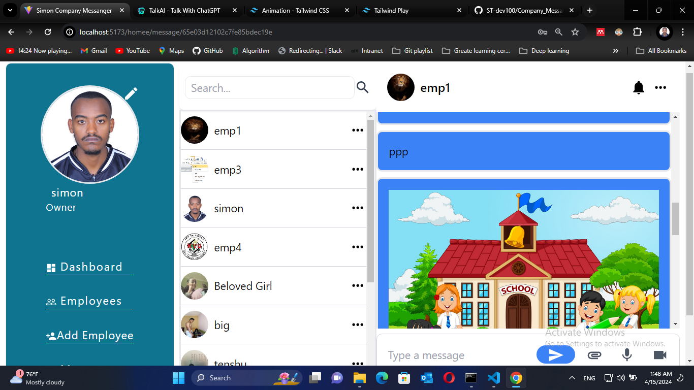
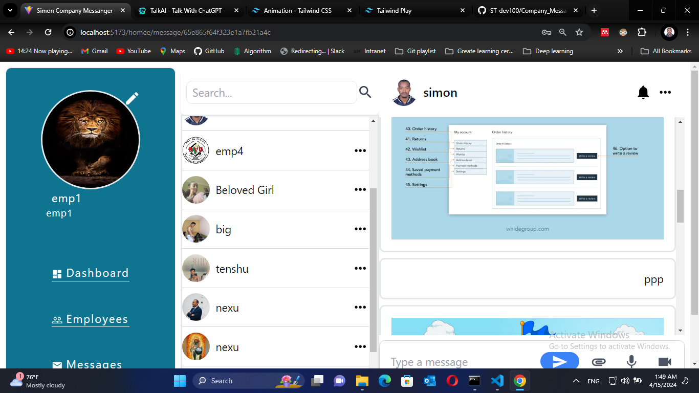
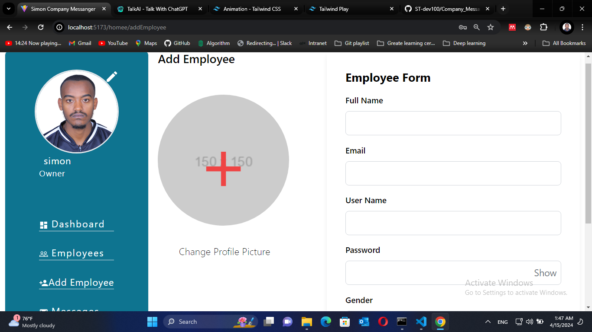
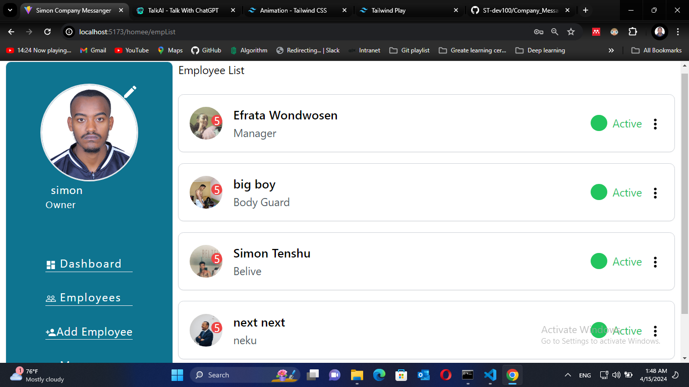

# <u>Company's Employees Chat Application</u>

## On Progress...

 ## :point_right: User account Login

 
 
 ## :point_right: Employee Simon Account 
  
 
## :point_right: Employee emp-1 Account
    
 
## :point_right: Add Employee
  
   
## :point_right: Employees List
  
 
